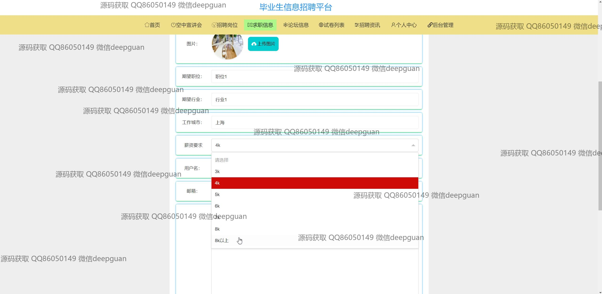
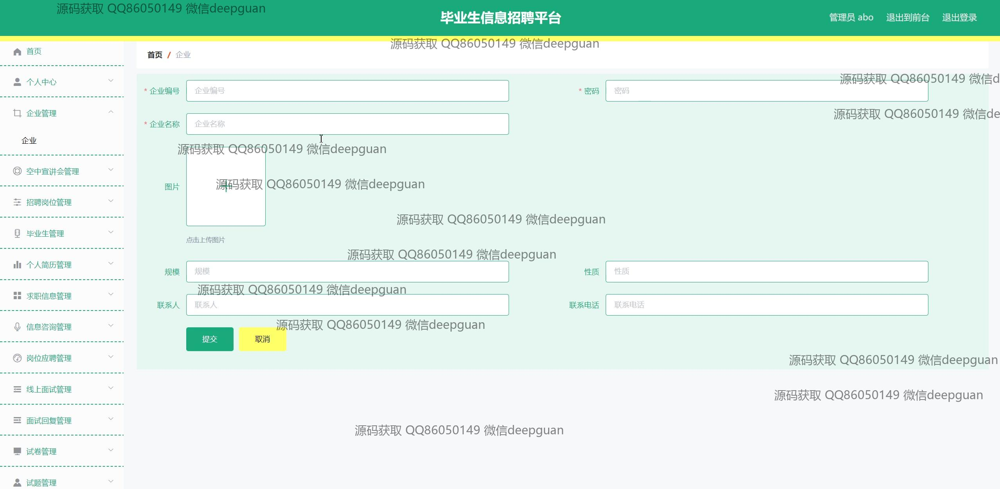
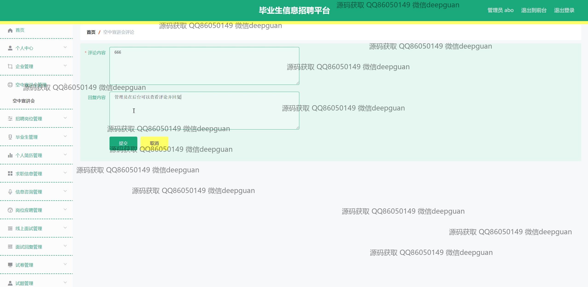
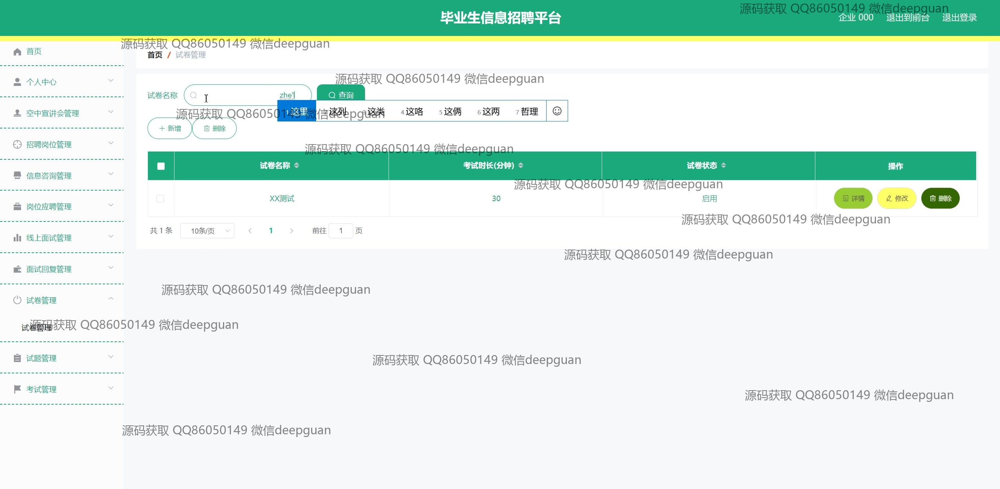
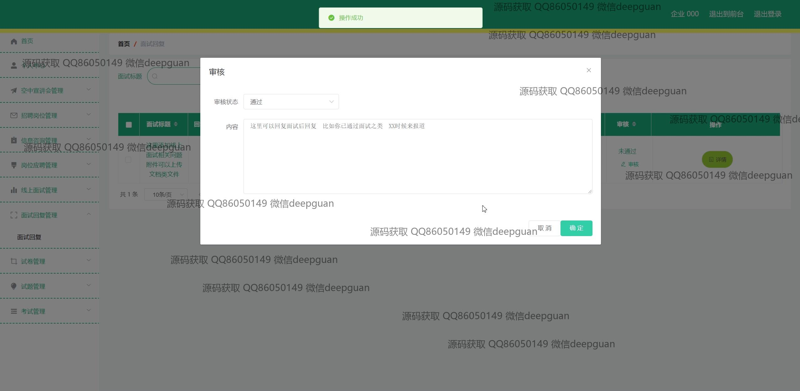

<h1 align="center">毕业生信息招聘平台</h1>

## 简介
毕业生信息招聘平台：基于Spring Boot开发，角色分为管理员、用户；主要功能包括招聘信息管理、求职信息管理、考试记录管理、论坛互动、企业与用户信息维护、在线面试预约及审核功能。    --计算机毕业设计源码；毕设源码；java毕业设计源码

## 联系方式

<h3 align="center">获取完整代码与数据库文件 + 微信：deepguan QQ: 86050149 QQ群: 783742310</h3>

<h3 align="center">可帮忙远程部署 包运行成功！提供远程部署、修改代码、设计文档指导、代码讲解等服务！</h3>

## 功能介绍（完整见运行截图）
管理员：管理招聘信息和企业信息，包括职位发布、修改和删除；管理用户信息、面试安排及回复；监控论坛活动，审核用户评论与帖子的合规性；管理考试记录和试卷，负责系统的整体运维工作。

企业用户：注册并登录平台，以发布和管理公司招聘岗位；填写并更新企业信息，如企业编号、名称、联系人和图片上传；使用在线面试功能进行招聘活动，包括安排、管理面试及回馈面试结果。

毕业生用户：注册并登录平台后，填写和更新个人简历信息，包括学历、期望职位、期望城市和薪资要求；浏览和申请平台上的招聘岗位；参与论坛讨论，发布帖子或评论招聘企业信息，使用在线面试功能进行远程面试。

其他用户：浏览平台首页获取招聘信息、空中宣讲会日期，论坛讨论和各项招聘资讯；通过搜索功能查找特定企业或职位，参与平台公开信息咨询和沟通活动，以便了解更多毕业生和招聘市场动态。

## 运行截图

本代码来源于网络,仅供学习参考使用!

